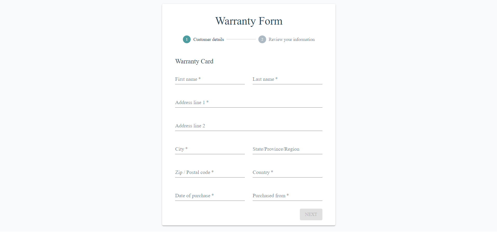
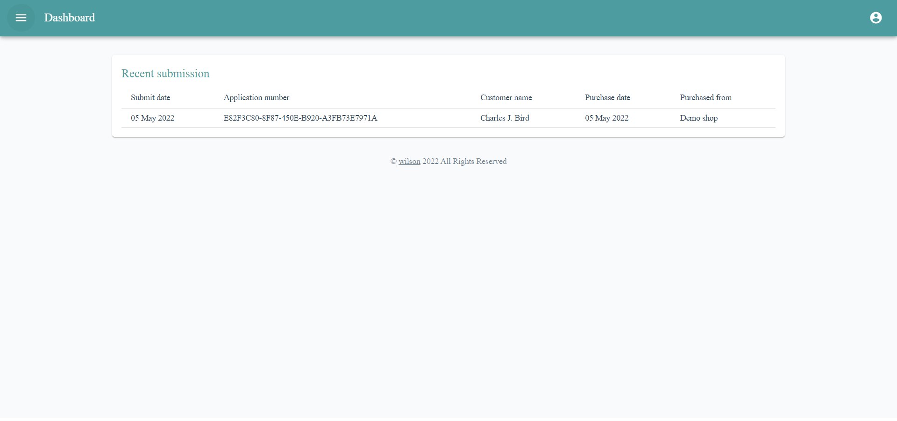

## Electronic form application

This is a warranty form application where the admin can view the application content and the customer can submit their
warranty information after purchasing the product.

Live demo url

- [https://nextjs-sample-olive.vercel.app/form/warrantyForm](https://nextjs-sample-olive.vercel.app/form/warrantyForm) (Warranty form)
- [https://nextjs-sample-olive.vercel.app/admin/login](https://nextjs-sample-olive.vercel.app/admin/login) (Admin
  dashboard)

```
Username: admin
Password: admin
```

## Getting Started
```bash
# Environment setting
ACCESS_TOKEN_SECRET : JWT access token secret
REFRESH_TOKEN_SECRET : JWT refresh token secret
MONGODB_URI : The url of MonogoDB server
MONGODB_DB : Database name
```

First, run the development server with environment:
```bash
npm run dev
```

Open [http://localhost:3000](http://localhost:3000) with your browser to see the result.

## Docker supported

To build the Docker image execute the following command:

```bash
docker build . -t eform
```

To run the docker a container

```bash
# use env file or env parameter to config the application.
docker run -p 3000:3000 eform

# Docker compose
docker-compose up
```

Open your browser and navigate to http://localhost:3000 to view the warranty form page.



